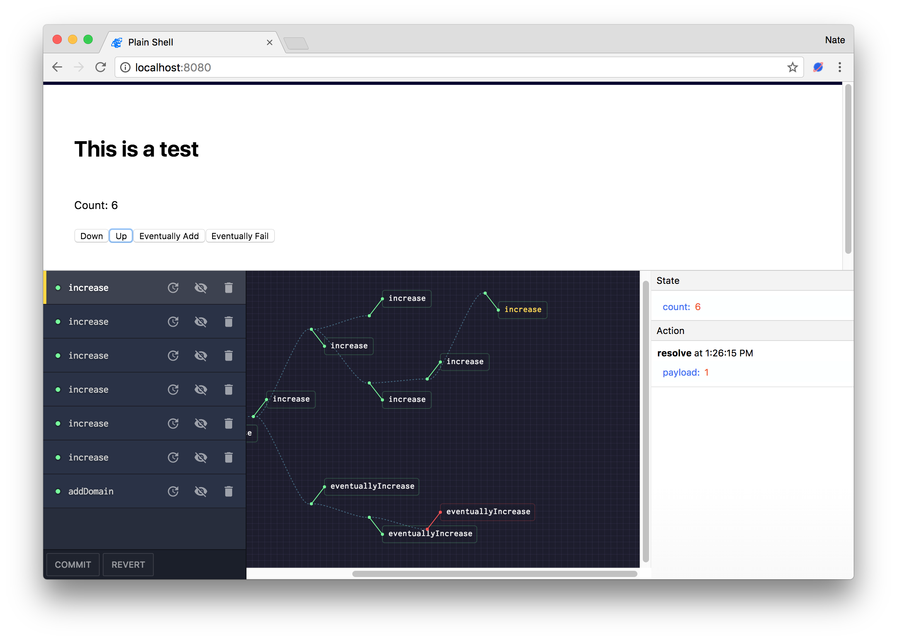

# Microcosm DevTools

Inspect the inner workings of your Microcosm.

```javascript
let repo = new Microcosm({ debug: true })
```



## Requirements

1. Microcosm 12.9.0 or higher
2. Chrome

## Installation

Checkout the Chrome Extension listing:

https://chrome.google.com/webstore/detail/ialgbdjboefngidjpgnjnbijdicaonph


This listing is private until we ship a 1.0. If you would like to run
the project locally:

1. Clone this repo
2. `npm install` (Or `yarn install` if you are using yarn as the package manager)
3. `npm run build`
4. Open Chrome extension page
5. Check "developer mode"
6. Click "load unpacked extension", and choose `shells/chrome`.

## Contributing

1. Clone this repo
2. `npm install`
3. `npm run dev`
4. A plain shell with a test app will be available at `http://localhost:8080`.

## License

[MIT](http://opensource.org/licenses/MIT)

## Credit where due

This is based heavily on the [vue-devtools](https://github.com/vuejs/vue-devtools). Thanks Vue.js for writing great stuff!
